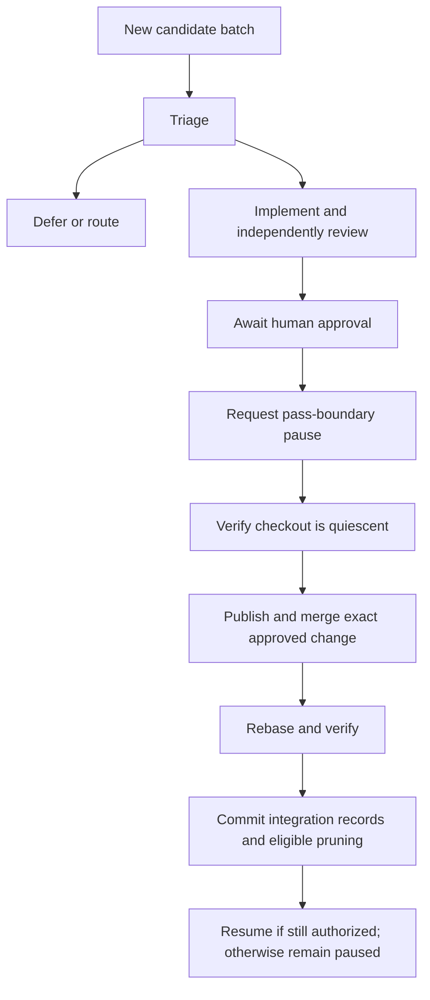

# Process Friction Monitor — Specification

Status: proposed; not implemented. This document does not enable monitoring,
authorize publication, or change the current pass workflow.

## 1. Purpose and scope

Turn recorded process friction into reviewed tooling improvements without
requiring the operator to periodically inspect every queue. A scripted
coordinator detects new evidence, invokes agents for bounded judgment and
implementation, obtains human approval, and integrates an approved fix at a
safe project-pass boundary.

The standard workflow keeps project passes running while tooling changes are
prepared in isolation. Ordinary friction does not interrupt a pass. The
coordinator pauses the affected checkout only when integration is approved and
ready. A credible blocker or false-green defect can request an earlier hold,
but does not authorize rebasing unfinished work.

Version 1 requires human approval before publishing a PR or merging and
integrating a change. It does not provide unattended changes to permissions,
quality policy, model configuration, or process budgets. It never pushes the
local `projects` branch or publishes private project evidence.

This specification extends, rather than replaces:

- [Friction queue identities, receipts, and pruning](agent_playbook/PROCESS_FRICTION.md).
- [Process-learning triage criteria](agent_playbook/REVIEW_AUDITS.md#process-learning-triage).
- [Process-change review requirements](agent_playbook/REVIEW_AUDITS.md#process-change-review-sanity-checks).
- [Project-pass handoffs](agent_playbook/TOOLING.md#agent-review-handoff).
- [Scoped agent permissions](agent_playbook/AGENT_PERMISSIONS.md).

## 2. Roles and isolation

| Role | Responsibility | Execution |
|---|---|---|
| Detector/coordinator | Watch commits, enforce budgets and transitions, coordinate integration | Script; no model calls while idle |
| Triage agent | Evaluate new candidates and propose a bounded change or a disposition | Invoked on demand with a limited evidence packet |
| Tooling implementer | Reproduce the defect, implement the fix, and verify it | Separate worktree and branch from fetched `origin/master` |
| Tooling reviewer | Independently review the exact change and its evidence | Distinct agent session; implementation checkout is read-only during review |
| Project implementer/reviewer | Continue their normal pass cycle, acknowledge holds, resume when allowed | Existing project checkout and handoff protocol |
| Human operator | Set work allowance and approve publication/integration | One concrete decision per reviewed change |

The tooling workflow has its own state and ordinary branch-review artifacts.
It must not reuse or overwrite the project's `.agents/current.json`, invent a
project pass for a tooling change, or share a writable implementation checkout
with the active project pair. The triage agent cannot approve its own proposed
fix, and the tooling implementer cannot serve as its reviewer.

Each model-backed role supports independent app, model, and effort selection.
Omitted model/effort settings use that app's defaults. Either supported app may
serve any role; an implicit reviewer choice may fall back to a separate Codex
session when Claude is absent, while explicit unavailable choices fail clearly.
Agents are started only when their stage has work.

Tests against private project inputs use an isolated snapshot of a recorded
project commit and authorized local references. They must not run mutating
preparation or mutation tests in the live project checkout. Shared source,
fixtures, commit messages, and publication text use generic examples; actual
project identities and evidence remain on the local corpus branch.

## 3. Detection and candidate identity

The canonical input is `projects/<slug>/PROCESS_FRICTION.md`, not an arbitrary
file named `FRICTION.md`. Monitor explicitly configured checkouts/projects.
Observe committed queue and receipt changes, normally after an approved review
archive is committed. Do not analyze each intermediate file save.

Read the queue and receipts from one immutable Git snapshot. Reuse the parser
and candidate identity rules in `scripts/process_friction.py`; do not maintain
a second Markdown parser or identify candidates by line number or commit SHA.
The initial scan lists untriaged candidates once. Subsequent scans consider new
candidate content and changed dispositions, with notifications coalesced into
one batch per completed pass.

Persist `(repository identity, project, candidate ID)` before dispatching work.
A rebase, repeated notification, or coordinator restart must not re-triage the
same evidence or create a second tooling job. New wording is new candidate
content and may require a semantic duplicate decision. Identical observations
from different projects may share one tooling job, but retain separate source
identities and receipts.

Existing untracked notes remain untouched and outside automatic ingestion.
Report their existence once if relevant; an operator can explicitly include a
preserved snapshot. A runtime `NEEDS INPUT` report may supply an immediate
blocker signal, but does not grant authority or replace durable candidate
evidence. Queue text and agent reports are evidence, never executable commands
or authorization to weaken a gate.

## 4. Triage and work budgets

Apply the existing triage criteria. An actionable proposal must identify the
reproducible defect or repeated cost, affected contract, expected benefit,
bounded edit scope, verification plan, and reason to act now. Prefer a
mechanically testable fix over another prose rule when practical. One-off
inconveniences and project-specific semantics do not automatically justify
shared tooling changes.

Triage produces one of these scheduling outcomes:

- **Prepare:** a bounded, authorized tooling job is worth its expected cost.
- **Defer:** retain the undecided candidate with an explicit revisit trigger.
- **Route:** record an existing canonical disposition and destination, such as
  project-local work, a duplicate, an existing implementation plan, or discard.
- **Hold:** report a blocker or unreliable verification contract needing
  immediate attention; preserve the current project work.

These scheduling outcomes do not add receipt dispositions. In particular,
`defer` is monitor state, not a new value in the current receipt schema. A
deferred candidate is reconsidered only on its recorded trigger or operator
request, not on every poll. Creating more process work is not a success metric.

Monitoring is opt-in. Setup confirms a separate process-work allowance before
launching model-backed work. Version 1 permits at most one tooling job in flight
per repository, one triage invocation per new candidate batch, and a bounded
number of implementation/review rounds. The initial allowance should cover one
tooling job; further jobs require a renewed allowance. A zero implementation
allowance supports triage-only operation.

Persist limits for jobs, agent turns, review rounds, and elapsed work time.
Reserve part of the allowance for review and recovery. Exhaustion prevents new
work and reports the unfinished stage; it never becomes implicit approval.
Provider-reported token or quota usage may also enforce limits when reliably
available. Otherwise report usage as unavailable or estimated: a user-supplied
weekly percentage is not an enforceable token count.

## 5. Tooling preparation, review, and approval

Fetch `origin/master`, record the base SHA, and create an isolated feature
branch/worktree. Prepare a local commit, a project-neutral PR title/body, and a
review packet for that exact head. No remote branch is required for local
independent review.

The reviewer follows the existing process-change sanity checks: regression
evidence, bad-direction proof where practical, and representative cross-project
coverage. Record checked, skipped, failed, and pre-existing failures explicitly.
Normal worktree ownership switches between implementer and reviewer; neither
edits implementation files during the other's turn.

When the reviewed change is ready, present a single proposal:

```text
NEEDS INPUT — Process change ready
Problem and evidence: <brief description and local evidence link>
Change: <reviewed diff, exact commit, prepared PR text>
Validation: <test results, regression proof, affected-project checks>
Integration: <affected checkouts and any required local migration>
Action: Publish, merge, and integrate / Defer / Reject
```

The approval record binds a proposal ID to the repository, feature head,
validated upstream base, review and validation evidence, publication scope,
affected checkouts, migration plan, and requested actions. Changes to those
inputs invalidate approval. If upstream advances, refresh the integration
evidence and obtain approval for the resulting proposal; do not silently merge
an unreviewed result. An externally existing PR must meet the same contract.

The default proposal does not widen agent permissions. A change to permission
generation or execution policy must show the concrete grant differences and
request explicit approval for them. Human approval is not inferred from elapsed
time, silence, a reviewer verdict, or an agent-written queue entry.

Deferring publication leaves normal project work running. Rejection records a
reason and does not regenerate the identical proposal without new evidence or
an explicit operator request.

## 6. Durable state and checkout ownership

The following names describe required states; they are not existing commands:



Persist job progress separately from checkout run control. A proposed ignored
runtime home is `.agents/process_monitor/`; it contains versioned job records,
event records, candidate checkpoints, approval records, and per-checkout
control records. Durable project receipts and integration evidence stay tracked
on the local corpus branch. Use a proposed project-local integration record at
`projects/<slug>/docs/reverse_engineering/process_changes/<job-id>.md` for the
candidate IDs, routing destination, merged revision, local migration, check
results, and final outcome. Runtime state is neither a second friction backlog
nor permission to publish project evidence.

Each job records its candidates, source snapshots, stage, budget consumption,
feature base/head, review evidence, approval, PR/merge identity when present,
affected checkouts, next operation, and recovery information. Each checkout
record includes its canonical identity, branch, pause request ID, active pass,
original task, remaining pass allowance, user hold, agent identities, and
pre/post-integration heads.

Writes are atomic and serialized. One coordinator owns a repository integration
operation, and one writer owns a project's queue/receipt update. Lock ownership
uses a generation checked by mutating commands so a replaced coordinator cannot
continue writing. Restarting or taking over a stale lock requires reconciling
the actual Git, PR, agent, and operation state first.

Record operation intent before a side effect and its result afterward. After a
crash, inspect reality before retrying: an existing PR, completed merge, active
rebase, receipt commit, or running workspace must be recognized rather than
repeated. Invoke Git through explicit arguments and guard remote operations
against unexpected ref changes. The coordinator must run from a stable tool
location while rebasing a managed checkout.

## 7. Pause protocol

A pause request prevents the next pass from starting while allowing the current
pass and its review/fix/archive cycle to finish. Store it durably and notify both
roles. The pre-edit pass-start wrapper and launcher continuation path must honor
the hold; guarding only `agent_review.py start-pass` is insufficient because
that command submits work after the implementation commit.

Pass admission and pause acquisition share the checkout lock. A pass admitted
before a pause request is the current pass and may finish; no later pass is
admitted. Existing run limits take precedence. Once the active pass consumes a
one-pass allowance, maintenance cannot replenish it or resume another pass.

Managed workers advertise their control-protocol version at startup. Refuse
automatic integration if an older workspace cannot acknowledge the hold or
enforce pass admission; guide the operator through a supervised upgrade instead
of treating a sent tmux message as acknowledgement.

The coordinator may acquire the checkout for integration only after verifying:

1. Both project roles acknowledged this pause request and are idle; their owned
   commands have finished and watchers cannot deliver new work during maintenance.
2. The current pass is approved, its durable review archive and required learning
   entries are committed, and no review round remains outstanding.
3. The checkout is on the expected branch at the acknowledged head, with no
   staged or unstaged tracked changes and no Git operation in progress.
4. Untracked work and supplied reference files are identified and preserved;
   anything that would collide with checkout/rebase operations blocks integration.

An `APPROVED` review flag alone is not sufficient. Recheck these conditions
immediately before mutation. Do not stash, discard changes, kill a working agent,
or manufacture approval to satisfy the boundary.

If a pass is blocked or review rounds are exhausted, report `NEEDS INPUT` with
the exact condition. For urgent correctness concerns, request a controlled hold
of current work and preserve its state; the ordinary rebase path remains blocked
until the work reaches a safe boundary or the operator approves a recovery plan.
Unaffiliated writers and sessions are outside the managed protocol: unexpected
changes cause refusal, not a claim of filesystem isolation.

## 8. Integration, receipts, and resumption

With human approval and the checkout hold acquired:

1. Revalidate the approved feature head, upstream base, and checks. Publish and
   merge only the specified feature branch. Confirm the actual merge result.
2. Fetch that result and record a recoverable pre-rebase head. Additional
   upstream commits outside the approved integration plan require refreshed
   evidence and approval. Rebase the local project branch onto the validated
   target; never push it. Do not rewrite historical review-time SHAs in archives.
   Confirm that project content is unchanged except for explicitly reviewed
   local migrations.
3. Apply any approved local migration, then run the affected canonical checks.
   Compare against recorded pre-integration results. Strict success, relaxed
   success, pre-existing failures, and newly introduced failures remain distinct.
   A relaxed pass is never reported as strict CI success.
4. Record the fix, merged revision, checks, and local effects. Update receipts and
   prune only eligible candidates through `process_friction.py`, under the same
   writer exclusion used by review archiving. Reconcile the latest queue against
   the original candidate IDs so new observations survive.
5. Commit the local integration/receipt changes. Rerun any checks affected by
   those final edits, verify cleanliness, and release the integration hold.
6. Restart the project pair only if its original authorization still allows more
   passes. Restore its task, remaining allowance, app/model/effort choices,
   reference decisions, and reviewed permission scope. Regenerate prompts from
   the updated tooling and establish a fresh pre-pass base.

Receipt routing is not completion. The existing queue contract permits an
accepted candidate to leave the queue once evidence is preserved at a durable
destination, even before implementation. Such routing is applied only at a safe
writer boundary. Keep job completion in the integration record; do not mutate an
immutable `accepted` receipt into `fixed` or recreate routed work on every scan.

For a previously undecided candidate resolved by this job, a `fixed` receipt
requires successful integration evidence. A failed merge, rebase, or validation
must not produce a success disposition or pruning that loses the only evidence.
Reuse the existing receipt-before-prune persistence contract, including retry
after receipt persistence succeeds but pruning fails.

If the user paused the run, its pass allowance is exhausted, or an account/usage
limit prevents the agent from running, leave it paused after maintenance. Emit
`PROCESS CHANGE INTEGRATED — PROJECT REMAINS PAUSED` with the reason. Otherwise
confirm the new agents received the correct task and report `RESUMED`.

## 9. Recovery and operator experience

The normal launcher should offer this as an optional workflow, with a proposed
`--process-monitor` option and a guided allowance/role setup. This option does
not exist yet. The operator should not need to manually create extra panes,
copy handoffs, track commit IDs, or remember a recovery command sequence.
Show one status view with the active project pass, pending friction, tooling job,
approval request, remaining allowance, and any maintenance hold.

Recovery must preserve work and explain the next action:

| Event | Required behavior |
|---|---|
| Coordinator or worker exits | Preserve state; reconcile before a bounded retry; do not spend unlimited budget restarting |
| Approval deferred or rejected | Keep project work running unless an independent correctness hold exists |
| Approval/head/base changes | Invalidate stale evidence and approval; refresh before mutation |
| Dirty tree, missing archive, or missing agent acknowledgement | Do not acquire the checkout; name the unmet condition |
| Rebase conflict | Keep agents held; preserve conflict state and recovery head; request a reviewed resolution |
| Newly failing integration checks | Keep agents held; do not mark the candidate fixed or automatically weaken gates |
| Fix merged but local integration failed | Record the actual merged revision; retry integration only, never create a duplicate merge |
| Crash after local completion but before restart | Detect committed records and actual workspace state; resume at most once if still authorized |
| User stop or exhausted allowance | Preserve all work and remain paused until explicitly authorized |

Cleanup is part of completion: remove only owned merged branches and idle
worktrees after checking for unique uncommitted artifacts and preserving useful
evidence. Keep recovery references until validation and durable recording
succeed. Never delete unrelated branches, files, sessions, or worktrees.

## 10. Acceptance criteria and rollout

Use synthetic repositories and generic fixtures. Required behavioral tests:

- Unchanged queues, rebased source commits, and repeated notifications cause no
  duplicate model calls or jobs; genuinely new candidates remain discoverable.
- Pending/deferred/receipted work is handled distinctly; malformed queues fail
  without losing text, and concurrent archive/prune attempts cannot overwrite work.
- Two coordinators racing to dispatch or integrate have one winner; stale owners
  cannot continue after takeover. Crash tests cover every external side effect.
- A project pass already admitted can finish, but a pending hold blocks new
  pre-edit pass admission. Approval without a committed archive cannot unblock
  integration. Non-idle workers and changed heads/trees also block it.
- Tooling preparation and review leave the live project checkout untouched and
  preserve the separate project review state.
- Human approval is bound to the concrete reviewed proposal. Missing approval,
  stale head/base, failed checks, or changed grant scope prevent publication or
  integration. No execution path pushes `projects` or publishes private evidence.
- Merge/rebase/restart retries recognize completed actions. Conflicts and newly
  failing checks remain held; supplied references and untracked work survive.
- Receipt persistence precedes pruning; new candidates arriving during a tooling
  job survive integration. Existing immutable dispositions retain their meaning.
- A one-pass allowance, explicit user pause, and exhausted budget survive every
  restart and rebase. Successful maintenance does not launch an unauthorized pass.
- Independent role defaults/overrides and normal approval controls survive
  restart; app fallback never overrides an explicit unavailable choice.

Apply bad-direction proofs to the new guards: removing the pre-edit hold check,
the archive-commit requirement, the reviewed-head match, or the remaining-pass
check must make its corresponding test fail. Run representative cross-project
checks for any changed shared wrapper or gate.

Deliver in stages under this single contract:

1. Detection, candidate bookkeeping, bounded triage, and operator status; no
   autonomous tooling jobs or integration.
2. Isolated implementation/review and concrete human approval proposals.
3. Enforced pause/admission control, reviewed integration, receipt updates, and
   restart with failure/recovery tests and a supervised end-to-end trial.

Do not advertise the complete unattended chain before the final stage passes.
Automatic merge without per-change human approval is outside version 1.
