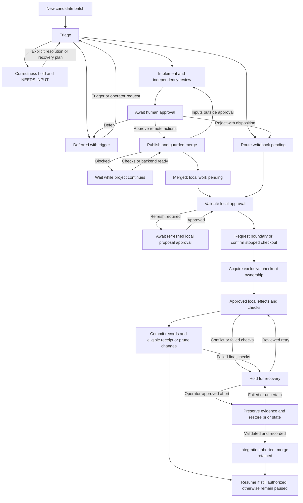

# Process Friction Monitor — Specification

Status: proposed; not implemented. This document does not enable monitoring,
authorize publication, or change the current pass workflow.

## 1. Purpose and scope

Turn recorded process friction into reviewed tooling improvements without
requiring the operator to periodically inspect every queue. A scripted
coordinator detects new evidence, invokes agents for bounded judgment and
implementation, obtains human approval, and integrates an approved fix at a
safe project-pass boundary.

The standard workflow keeps project passes running during tooling preparation,
review, publication, and merge. Ordinary friction does not interrupt a pass.
Acquire checkout ownership only for approved local receipt writeback or for
integration after merge. A credible blocker or false-green defect can request
an earlier correctness hold, but does not authorize rebasing unfinished work.

Version 1 requires human approval before publishing a PR or merging and
integrating a change. It does not provide unattended changes to permissions,
quality policy, model configuration, or process budgets. It never pushes the
local `projects` branch or publishes private project evidence.

This specification extends, rather than replaces:

- [Friction queue identities, receipts, and pruning](agent_playbook/PROCESS_FRICTION.md).
- [Process-learning triage criteria](agent_playbook/REVIEW_AUDITS.md#process-learning-triage).
- [Process-change review requirements](agent_playbook/REVIEW_AUDITS.md#process-change-review-sanity-checks).
- [Project-pass handoffs](agent_playbook/TOOLING.md#agent-review-handoff).
- [Scoped agent permissions](agent_playbook/AGENT_PERMISSIONS.md).

## 2. Roles and isolation

| Role | Responsibility | Execution |
|---|---|---|
| Detector/coordinator | Watch commits, enforce budgets and transitions, coordinate integration | Script; no model calls while idle |
| Triage agent | Evaluate new candidates and propose a bounded change or a disposition | Invoked on demand with a limited evidence packet |
| Tooling implementer | Reproduce the defect, implement the fix, and verify it | Separate worktree and branch from fetched `origin/master` |
| Tooling reviewer | Independently review the exact change and its evidence | Distinct agent session; implementation checkout is read-only during review |
| Project launcher/watchers | Admit and dispatch authorized passes, respecting durable holds | Project-owned processes; no dependency on a live monitor |
| Project implementer/reviewer | Continue their pass cycle, acknowledge holds when running, resume when authorized | Enrolled checkout with the new managed admission protocol |
| Human operator | Set work allowance and approve publication/integration | Approve the concrete proposal and any later out-of-scope changes |

The tooling workflow has its own state and ordinary branch-review artifacts.
It must not reuse or overwrite the project's `.agents/current.json`, invent a
project pass for a tooling change, or share a writable implementation checkout
with the active project pair. The triage agent cannot approve its own proposed
fix, and the tooling implementer cannot serve as its reviewer.

Each model-backed role supports independent app, model, and effort selection.
Omitted model/effort settings use that app's defaults. Either supported app may
serve any role; an implicit reviewer choice may fall back to a separate Codex
session when Claude is absent, while explicit unavailable choices fail clearly.
Agents are started only when their stage has work.

Tests against private project inputs use an isolated snapshot of a recorded
project commit and authorized local references. They must not run mutating
preparation or mutation tests in the live project checkout. Shared source,
fixtures, commit messages, and publication text use generic examples; actual
project identities and evidence remain on the local corpus branch.

## 3. Detection and candidate identity

The canonical input is `projects/<slug>/PROCESS_FRICTION.md`, not an arbitrary
file named `FRICTION.md`. Monitor explicitly configured checkouts/projects.
Observe committed queue and receipt changes, normally after an approved review
archive is committed. Do not analyze each intermediate file save.

Read the queue and receipts from one immutable Git snapshot. Reuse the parser
and candidate identity rules in `scripts/process_friction.py`; do not maintain
a second Markdown parser or identify candidates by line number or commit SHA.
Receipt schema 1 implicitly uses the current text-hash identity algorithm:
trim trailing whitespace on each line, join with newlines, trim outer space,
and hash the UTF-8 result with SHA-256. Freeze that algorithm as `text-v1` and
record the parser/tool revision and original candidate text in job snapshots.
Rendering changes must not silently change identity. Jobs that alter candidate
boundaries, normalization, or receipt schemas need compatibility proofs before
merge; an identity-changing migration is outside automatic v1 integration.
Preserve old receipts and job bindings rather than rehashing them in place.
The initial scan lists untriaged candidates once. Subsequent scans consider new
candidate content and changed dispositions, with notifications coalesced into
one batch per completed pass.

Persist `(repository identity, project, candidate ID)` before dispatching work.
A rebase, repeated notification, or coordinator restart must not re-triage the
same evidence or create a second tooling job. New wording is new candidate
content and may require a semantic duplicate decision. Identical observations
from different projects may share one tooling job, but retain separate source
identities and receipts.

Existing untracked notes remain untouched and outside automatic ingestion.
Report their existence once if relevant; an operator can explicitly include a
preserved snapshot. A runtime `NEEDS INPUT` report may supply an immediate
blocker signal, but does not grant authority or replace durable candidate
evidence. Queue text and agent reports are evidence, never executable commands
or authorization to weaken a gate.

Registration assigns a persistent repository identity and records its Git
common directory plus the managed checkout identity. Linked worktrees belong
to the same repository for job limits and integration exclusion; a remote URL
or current branch name alone is not an identity. Relocation or a new clone
requires reconciliation, not silently treating old jobs as new candidates.

Registration also declares production or controlled-experiment mode. Experiment
checkouts are observation-only: the monitor may report friction, but cannot
pause, patch, rebase, prune, or resume their runs. The study owner/controller
governs amendments to frozen experimental conditions. An unknown mode refuses
automation. This distinction does not require the experiment controller to
exist before production monitoring can be implemented.

The related `PROJECT_EXPERIMENT_SPEC.md` is on its own proposed-spec branch.
Add reciprocal repository links when both documents are present on master;
neither workflow may change an experiment's frozen conditions automatically.

## 4. Triage and work budgets

Apply the existing triage criteria. An actionable proposal must identify the
reproducible defect or repeated cost, affected contract, expected benefit,
bounded edit scope, verification plan, and reason to act now. Prefer a
mechanically testable fix over another prose rule when practical. One-off
inconveniences and project-specific semantics do not automatically justify
shared tooling changes.

Triage produces one of these scheduling outcomes:

- **Prepare:** a bounded, authorized tooling job is worth its expected cost.
- **Defer:** retain the undecided candidate with an explicit revisit trigger.
- **Route:** record an existing canonical disposition and destination, such as
  project-local work, a duplicate, an existing implementation plan, or discard.
- **Hold:** report a blocker or unreliable verification contract needing
  immediate attention; preserve the current project work.

These scheduling outcomes do not add receipt dispositions. In particular,
`defer` is monitor state, not a new value in the current receipt schema. A
deferred candidate is reconsidered only on its recorded trigger or operator
request, not on every poll. Creating more process work is not a success metric.
Triage stores proposed dispositions in monitor state; this does not reserve
the candidate or prevent another authorized writer from deciding it. Reconcile
the latest committed queue and receipts before each costly stage, before
publication/merge, and again under exclusive checkout ownership at writeback.
An existing immutable receipt wins: retain it and skip any new decision for that
ID. A missing unreceipted candidate needs reconciliation, not an invented
receipt. If all job candidates are decided before publication or merge, stop
the job unless the operator approves a refreshed proposal with independent
scope. Changes in scope or contradictory evidence invalidate the old proposal.

If another writer decides a candidate after merge, record that decision and
skip its receipt update; local integration must not fail solely because the
ID was already decided or pruned. Remaining receipted text can use the tool's
prune-only path in a validated batch; never retry triage with a new disposition.
The job record reports the actual merge and checks without changing the receipt.

Route outcomes also require canonical writeback, even when no tooling job is
created. Prepare a receipt/prune batch preserving unique evidence at its
destination. Obtain local-write approval unless enrollment already authorizes
that disposition class, then use the section 7 boundary protocol, validate,
persist receipts before pruning, and commit the batch. Release only its hold.
Until persistence succeeds, show `ROUTE WRITEBACK PENDING`, not routed success.
Detection-only mode reports the batch without writing tracked files. Defer
stays undecided with its revisit trigger; rejection that discards a candidate
uses this same writeback path.

Monitoring is opt-in. Setup confirms a separate process-work allowance before
launching model-backed work. Version 1 permits at most one tooling job in flight
per repository, one triage invocation per new candidate batch, and a bounded
number of implementation/review rounds. The initial allowance should cover one
tooling job; further jobs require a renewed allowance. A zero implementation
allowance supports triage-only operation.

Persist limits for jobs, review rounds, and elapsed work time.
Reserve part of the allowance for review and recovery. Exhaustion prevents new
work and reports the unfinished stage; it never becomes implicit approval.
V1 records provider-reported token/quota usage observationally and marks missing
measurements unavailable. Hard token/spend caps are deferred; a user-supplied
weekly percentage is not an enforceable token count.

### Enforced allowance and exhaustion

V1 requires finite job and review-round limits plus a wall-time limit for each
model-backed invocation and a cumulative process-work allowance. Reserve the
invocation's maximum runtime from the remaining allowance before dispatch;
include retries and context reconstruction in accounting. Reconcile actual
usage after confirmed termination; unresolved usage retains its reservation.
Waiting for human approval consumes no model work and must not start a
replacement worker. A turn limit is optional and may be claimed only when the
adapter can measure and enforce it. Prompts alone are not budget enforcement.

A supervisor controls every monitor-launched model invocation, including
triage, implementation, review, and any model-backed recovery. This applies
from stage 1's first triage call. Each invocation requires the same budget
reservation and independent watchdog; a detector-only subset may run without
the watchdog, but may make no model calls.

V1 requires a new independent backend watchdog with an expiring
invocation lease, installed before the worker starts. Its expiry enforcement
runs outside the controller and supervisor processes and their termination
groups. The supervisor renews a short liveness lease that cannot exceed the
original hard deadline minus the teardown bound. Workers cannot renew it.
If the supervisor dies, the watchdog stops all work in the invocation's tested
containment boundary within that bound, including when the controller also
dies. No existing trace runner is assumed to provide this backstop. An adapter
without independent enforcement cannot claim the v1 wall-time guarantee.

Recovery reconciles the lease, original deadline, and consumed or reserved
allowance before retrying; uncertain usage cannot be reset to zero. Preserve
unfinished edits outside the invocation's process lifetime. Do not signal the
project pair or unrelated commands. A missed bound is a protocol failure, not
successful budget enforcement.

Process-work exhaustion stops further tooling dispatch. It does not pause an
otherwise authorized project run. If maintenance already owns the checkout,
keep that hold until recovery establishes a safe release; user and correctness
holds remain independent. Report which allowance was exhausted and which
actors may still proceed.

## 5. Tooling preparation, review, and approval

Fetch `origin/master`, record the base SHA, and create an isolated feature
branch/worktree. Prepare a local commit, a project-neutral PR title/body, and a
review packet for that exact head. No remote branch is required for local
independent review.

The reviewer follows the existing process-change sanity checks: regression
evidence, bad-direction proof where practical, and representative cross-project
coverage. Record checked, skipped, failed, and pre-existing failures explicitly.
Normal worktree ownership switches between implementer and reviewer; neither
edits implementation files during the other's turn.

When the reviewed change is ready, present a single proposal:

```text
NEEDS INPUT — Process change ready
Proposal/job IDs and requested actions: <publish / merge / integrate>
Problem and evidence: <brief description and local evidence link>
Candidates: <IDs, source snapshot, latest receipt reconciliation>
Tooling: <reviewed feature base/head SHAs, diff, prepared PR title/body>
Upstream: <observed SHA; pinned or validated-fast-forward policy>
Merge: <backend, strategy, ref guards, composed-tree check recipe>
Validation: <test results, regression proof, affected-project checks>
Checkout: <repository/checkout/branch IDs, observed head, run-grant ID>
Boundary: <exact head SHA OR next safe boundary after merge>
Local checks: <versioned recipe and acceptable baseline conditions>
Local effects: <receipt/prune batch, record paths, migration or none>
Permissions: <concrete grant differences or none; installer approval if needed>
Resumption: <existing grant and holds only; stopped checkout stays stopped>
Action: Approve specified actions / Defer / Reject
```

Approval binds all fields above and the evidence digests, including the exact
feature head and publication text. It can authorize merge and later integration
together, or only a named subset; missing actions remain unapproved. A local
route-only batch uses an equivalent concrete proposal without publication or
merge. An externally existing PR meets the same checks. New tooling commits,
scope, migrations, or grant differences require refreshed review and approval.

### Upstream advancement and merge

Publish and merge after approval while project work continues. No maintenance
hold is acquired for remote CI, review queues, or a blocked merge. The proposal
chooses one upstream policy:

- **Pinned:** merge against the specified upstream SHA; advancement requires
  a refreshed proposal.
- **Validated fast-forward:** allow upstream to advance from the approved SHA
  without changing the reviewed feature head. For each new target, record the
  composed merge tree, rerun the approved recipe, and obtain independent review
  of the integration delta. New failures outside the baseline, changed effective
  grants/migration needs, a rewind, or an unreviewed feature update require new
  approval. Fresh conforming check/review receipts extend the approved evidence.

Both policies require merged-tree compatibility checks for `text-v1`, receipt
schemas, and the enrolled control/ingestion versions. These apply to upstream
changes too; a parser change cannot silently invalidate pending jobs or
receipts. Incompatible identity migrations remain supervised work outside v1.

The second policy avoids repeated human approval for ordinary upstream progress
while keeping the actual merge inputs checked. It does not authorize adopting
arbitrary later code without validation. Reconcile current candidate receipts
again before the merge request. An uncertain request must be reconciled before
retrying; a timeout does not establish that nothing happened.

Before enabling automated publication/merge, demonstrate how the chosen Git/PR
backend enforces the validated feature head, upstream target, and check binding
at mutation time, for example through conditional ref updates or an equivalent
tested merge-queue contract. A read before an unguarded write is insufficient.
If the backend cannot enforce these conditions, keep that action supervised
and report the capability limit. Record the actual merge commit and tree.
That confirmed revision becomes this job's local integration target; later
upstream commits do not silently move it.

### Approval at the eventual local boundary

**Exact head** means the enrolled checkout must still be at the specified
project SHA when ownership is acquired. It is useful for an already stopped
checkout. Advancement requires refreshed local approval; the monitor does not
hold an active project through remote merge waits merely to preserve this SHA.

**Next safe boundary after merge** authorizes ordinary passes under the recorded
run grant while preparation and merge proceed. After merge, atomically request
the hold and record the admitted pass at that instant. It may finish review and
archive; no later pass is admitted. The proposal's observed project head is
context, not an exact target. This policy also accepts a stopped boundary when
the run finishes before the hold is requested. For route-only writeback,
request the boundary after local approval; there is no merge to await.

Once owned, record the actual boundary head and rerun baseline/compatibility
checks using the approved recipe. Changed checkout/branch, run grant, upstream
ancestry outside the plan, unexpected local effects, or failures outside the
approved conditions require refreshed local approval. The completed merge
remains a fact; do not republish it. Expected pass advancement before the hold
and fresh conforming check receipts do not themselves invalidate approval.

The default proposal does not widen agent permissions. A change to permission
generation or execution policy must show the concrete grant differences and
request explicit approval for them. Human approval is not inferred from elapsed
time, silence, a reviewer verdict, or an agent-written queue entry.

Deferring publication leaves normal project work running. Rejection records a
reason and, where it decides candidates, queues the canonical route writeback
from section 4. Neither regenerates the identical proposal without its recorded
revisit trigger, new evidence, or an explicit operator request.

## 6. Durable state and checkout ownership

This is the job-flow overview, not an existing command interface. Checkout
holds and completed remote operations are separate durable records; recovery
returns to the unfinished operation rather than replaying the whole diagram.



Persist job progress separately from checkout run control in the proposed
`<git-common-dir>/nesrev-process-monitor/v1/` store. Resolve and canonicalize
the common directory through Git; all linked worktrees use this one registry,
job limit, operation lock, event journal, approval store, and per-checkout
control record. This location is outside tracked/untracked working-tree
content and needs no `.agents/` ignore assumption. Do not place a separate
repository-wide job registry in each worktree's `.agents/` directory. Reviewed
enrollment must explicitly authorize the control tool's metadata access.

Durable project receipts and integration evidence stay tracked
on the local corpus branch. Use a proposed project-local integration record at
`projects/<slug>/docs/reverse_engineering/process_changes/<job-id>.md` for the
candidate IDs, routing destination, merged revision, local migration, check
results, and final outcome. Runtime state is neither a second friction backlog
nor permission to publish project evidence.

Each job records its candidates, source snapshots, stage, budget consumption,
feature base/head, review evidence, approval, PR/merge identity when present,
receipt reconciliations, affected checkouts, integration attempts, next
operation, and recovery information. Each checkout record includes its identity,
branch, pause request, active admission, structured run grant, original task,
holds, protocol/worker identities, stopped/running status, and heads before
and after integration.

Keep user, correctness, and maintenance holds as separate records with their
own IDs, owners, and release conditions. Successful integration or an approved,
verified abort releases only that job's maintenance hold. Holds survive
controller death and do not expire into permission to run. Missing or malformed
control state fails closed for a registered managed workspace. An ordinary
workspace without monitor enrollment keeps its existing behavior.

Separate locks serialize repository tooling jobs and checkout control-state
transactions. Project dispatchers and the monitor use the same local checkout
lock for admission and holds; it is not held across model calls or remote waits.
Track monitor-owner and project-dispatcher generations separately. Managed
commands reject replaced owners, but restarting the monitor does not invalidate
the project dispatcher. Takeover first reconciles actual Git, PR, process, and
operation state; a timeout is not a release of maintenance ownership.

The current triage/archive tools have no writer lock; their documentation only
requires one writer at a time. In v1, receipt/prune writes are serialized by
the maintenance hold and verified shutdown of all managed project writers,
followed by one coordinator applying the batch. Do not claim that old archive
scripts take the new controller lock. A live legacy workspace cannot enter
automatic maintenance; a fully stopped one can use the stopped path below.
Unmanaged writers remain outside this convention and cause refusal on detected
interference; it is not a filesystem security boundary.

Record operation intent before a side effect and its result afterward. After a
crash, inspect reality before retrying: an existing PR, completed merge, active
rebase, receipt commit, or running workspace must be recognized rather than
repeated. Invoke Git through explicit arguments and guard remote operations
against unexpected ref changes. The coordinator must run from a stable tool
location while rebasing a managed checkout.

Durable intent alone does not prove exactly-once delivery. If a crash leaves
model dispatch or a remote mutation uncertain, reconcile its recorded worker
or operation identity. When that cannot establish the outcome, stop that stage
with `NEEDS INPUT` rather than spending again or repeating the mutation.

## 7. Pause protocol

### New managed pass admission

Current tooling has a free-text launcher `--task`, no structured pass allowance,
and no automatic pre-edit admission. Its kickoff prompt does not explicitly
call `project-pass-start`. The following integration work is required, not an
assumption about that launcher:

- Enrollment records a structured run grant: either a finite pass count or
  explicit until-gold authorization, plus the task and independent user holds.
  A stopped-only enrollment grants no new passes. Never infer a remaining count
  from prose. Importing an existing workspace requires a reviewed enrollment
  baseline, including any pass in flight; missing state is not zero work.
- The project launcher admits the initial pass; its designated continuation
  watcher admits subsequent passes. Both call the same local admission routine
  under the checkout control lock before dispatch. A pending hold or spent grant
  refuses dispatch. One admission covers intake/pass 0 or one later pass,
  including reviews, fixes, and archive; debit a finite grant once on admission,
  with no automatic refund for failed or abandoned work.
- Update kickoff and handoff prompts to use `project-next-pass`, select the
  corridor, and call `project-pass-start` before edits. That wrapper must
  validate the already-issued admission and record planning, not debit again.
  After archive and admission completion, the implementer yields to the project
  continuation watcher for the next admission and dispatch. Update both the
  watcher and prompts; admission must not depend on remembering a wrapper.
- Canonical pass-start and continuation commands check the same admission and
  hold state. Guarding only post-commit `agent_review.py start-pass` cannot stop
  an extra implementation pass. Review/fix/archive handoffs remain deliverable
  under the existing admission while a boundary hold waits.

Project dispatchers run independently of the monitor's process lifetime and
shutdown group. Admission, completion, and archive observation writes use local
durable state, without a monitor RPC, heartbeat, or approval. The monitor only
participates when it requests a hold or performs authorized maintenance; it
does not issue routine pass admissions. With valid control state, no blocking
hold, and remaining project authorization, monitor failure or shutdown leaves
ordinary pass continuation running. It neither releases an existing hold nor
resets the grant. Missing/malformed control state still fails closed.

Admission and hold acquisition share the new checkout lock. A pause request
records its admission watermark atomically: the admitted pass may finish,
and no later pass may start. Admissions have unique pass/attempt identities;
recovery is idempotent and cannot replenish the grant. Completion binds the
committed closeout evidence and, for paired work, approval and review archive.
Until-gold authorization stops at recorded gold completion. Maintenance cannot
extend either authorization mode.

Managed workers advertise their control version at startup. Live workspaces
without this protocol are observation-only until a supervised enrollment;
sending a tmux message does not upgrade them. All managed launch paths must
check enrollment before dispatch, including restarts while maintenance is held.

### Acquiring a boundary

Both paths require the expected checkout/branch/head, a clean index and tracked
tree, no Git operation in progress, and preserved untracked work/reference files
with no checkout collisions. Reconcile admission/review state and recheck all
conditions immediately before mutation. An `APPROVED` flag or absent tmux server
alone does not establish a boundary.

| Workspace state | Required boundary evidence |
|---|---|
| Running managed pair | Both current workers acknowledge this hold, binding its ID, worker generations, admitted pass, head, and completed review archive. Finish outstanding review/fix/archive work, commit learning entries, then retire the admission. Shut down only the acknowledged idle workers and watchers; verify their owned commands have exited before acquiring ownership. |
| Already stopped checkout | Prove no live owned workers, watchers, or commands, no admitted/incomplete pass, and no unfinished review. No agent acknowledgement is required. Require committed paired-review artifacts only when that work used paired review; completed solo work uses its canonical closeout evidence. Record this as a stopped boundary and preserve its stop reason. |

The second path covers gold completion, exhausted grants, idle needs-input
stops before another pass, and closed sessions. A crashed or closed pane with
unfinished admitted work does not qualify merely because the tree is clean.
Reconciliation may retire an admission whose required completion evidence is
already committed; it must not invent approval. Enroll stopped legacy or solo
checkouts with an explicit no-active-pass baseline and inspected evidence.
Missing or contradictory evidence needs input, not phantom acknowledgements.

If a blocked pass or exhausted review still has unfinished work, preserve it
and report the specific impediment. Do not stash, discard changes, or kill a
working agent to manufacture a boundary. Urgent correctness holds preserve
current work and may require a separately approved recovery plan.

Once exclusive ownership is acquired, keep it through local writes and checks.
A crash or timeout does not release it. Recovery reconciles actual processes,
Git state, and the hold generation before proceeding. A stopped enrollment
stays stopped after integration unless separately authorized to start.

## 8. Integration, receipts, and resumption

After the approved remote actions in section 5 have completed, use the valid
local approval below. A route-only batch skips remote actions and rebase, but
uses the same checkout ownership and receipt writeback rules.

1. Request the hold and acquire a running or stopped boundary under section 7.
   Verify the actual boundary head against the approval policy and record the
   prescribed baseline checks on that snapshot before local mutation.
2. Fetch and confirm the recorded merge revision; do not move the integration
   target to a later master. Reconcile candidate receipts again. Preserve and
   skip already-decided IDs; unexpected ancestry, permission effects, or
   migration needs require a refreshed local proposal.
3. Pin the pre-integration head under the immutable local ref
   `refs/nesrev/process-monitor/<job-id>/<checkout-id>/<attempt-id>/before`
   and record its object ID. Pin additional reachable review bases/heads not
   retained by that history. Disclose historical objects that are unavailable.
   Record the pre-integration launch/control/ingestion versions, including
   external tool paths, alongside the baseline checks for possible restoration.
   Rebase onto the confirmed target; never push the project branch or private
   pins. Preserve historical review SHAs in archives. Confirm that project
   content is unchanged except for explicitly reviewed local migrations.
4. Apply any approved local migration, then run the affected canonical checks.
   Compare against recorded pre-integration results. Strict success, relaxed
   success, pre-existing failures, and new failures remain distinct.
   A relaxed pass is never reported as strict CI success.
5. Prepare the integration record and receipt/pruning changes in an isolated
   snapshot; validate the complete prospective edit batch and affected checks
   before a `fixed` disposition. Then record the fix, merged revision,
   checks, and local effects, including any disposition made by another writer.
   Triage only still-undecided candidates through `process_friction.py`; already
   receipted text uses prune-only recovery. The maintenance hold, stopped
   project writers, and single coordinator serialize these writes;
   there is no existing archive lock. Persist receipts before pruning, preserve
   new observations, and reconcile missing IDs instead of fabricating receipts.
6. Commit the local integration/receipt changes. Rerun any checks affected by
   those final edits, verify cleanliness and that the published tree matches
   the validated changes. Keep the maintenance hold while preparing resumption.
7. Restart a pair parked by this maintenance only if its structured run grant
   still permits work. A previously stopped checkout stays stopped without a
   separate start authorization. Restore the task, remaining allowance,
   app/model/effort choices, reference decisions, and reviewed permission scope.
   Regenerate prompts from updated tooling and establish a fresh pre-pass base.

### Completion and resumption are separate

Record `merged`, `integrated-and-verified`, and `resumed` separately.
An upstream merge does not prove local integration, and successful integration
does not grant permission for another pass. A later restart or cleanup failure
does not erase the merge or justify recreating the tooling job.

At restart, preserve the old completed review state and archives as historical
evidence. A control-aware launcher must recognize the already-committed archive
and avoid redelivering its old archive/handoff prompt after the rebase. Do not
rewrite review-time SHAs or overwrite an unfinished review. Record the new
workspace generation and pre-pass head before admitting fresh work.

If no further project work or restart is authorized, do not launch agents.
After integration and recording succeed, release only this job's maintenance
hold and record the reason the project remains paused. User/correctness holds
and the exhausted pass allowance remain intact.

Restore the previously resolved agent applications and explicit model/effort
settings. Initial app fallback is not repeated during recovery: a missing app
requires input. Stage fresh project workers without dispatching semantic work.
After confirmed local completion, the coordinator releases only its maintenance
hold. The project launcher then atomically rechecks all holds, remaining pass
allowance, and the integration generation before admitting the continuation.
A user pause registered before admission blocks dispatch; a pass admitted first
follows the finish-current-pass rule in section 7. Stop staged idle workers when
resumption is disallowed. Confirm the new worker's acknowledgement before
reporting `RESUMED`; uncertainty remains a pending restart, not a reason to
launch another pair.

Receipt routing is not completion. The existing queue contract permits an
accepted candidate to leave the queue once evidence is preserved at a durable
destination, even before implementation. Routing uses section 4's safe-boundary
writeback. Keep actual job completion in the integration record, even if another
writer has already decided its candidates. Do not mutate an immutable `accepted`
receipt into `fixed` or recreate routed work on every scan.

For a previously undecided candidate resolved by this job, a `fixed` receipt
requires successful integration evidence. A failed merge, rebase, or validation
must not produce a success disposition or pruning that loses the only evidence.
Reuse the existing receipt-before-prune persistence contract, including retry
after receipt persistence succeeds but pruning fails.

Report `PROCESS CHANGE INTEGRATED — PROJECT REMAINS PAUSED` with the reason when
the checkout stays stopped, including gold, an exhausted grant, or a user hold.
Otherwise confirm the new agents received the correct task and report `RESUMED`.

### Operator-approved integration abort

Offer abort as well as retry when a conflict or failed check leaves maintenance
held. This is an explicit local recovery action, not an upstream revert. It is
available before this attempt is `integrated-and-verified` and before any new
project pass has been admitted. Undoing a completed rollout is separate work.

Prepare and verify the preservation snapshot described below before presenting
a concrete abort proposal binding the job/attempt, checkout/branch,
hold generation, current Git state, immutable before-pin OID, preservation
snapshot, exact restoration operations, baseline check recipe, and restart
choice. Show what will be restored and what remains merged upstream. Obtain
explicit operator approval; the original rollout approval does not authorize
a reset. Changed inputs require reconciliation before mutation; changed
restoration targets or effects require fresh approval.

1. Retain exclusive ownership and verify that all owned project commands remain
   stopped. The snapshot preserves interim commits under durable refs and saves
   uncommitted work, index/conflict stages, rebase metadata, resolutions, and
   diagnostics outside the checkout. Revalidate it against the approved state
   before destructive operations. Preserve untracked/reference files and check
   for path collisions.
   Unrelated writes, an intervening pass, or effects outside the restoration
   plan require a separate recovery decision; never discard them implicitly.
2. Abort an owned in-progress rebase, or restore the approved branch to its
   pinned pre-integration head if the rebase finished. Verify the resulting
   head, tracked tree, and absence of a Git operation. Restore the recorded
   compatible launch/tool versions; unsupported migration or permission changes
   need supervised recovery. Do not roll back the shared control store: retain
   grants, consumed allowances, other holds, and observation history. Reconcile
   only this attempt's local integration state to the restored revision.
3. Run the approved checks against the pre-integration baseline, keeping strict,
   relaxed, and pre-existing failure results distinct. Preserve the attempt's
   failed receipts/pruning batch as evidence, not active success dispositions;
   the restored queue and receipts must match the before-pin snapshot. Create
   no applied-fix epoch or `fixed` receipt for this aborted attempt.
4. Commit an abort-only record on top of the restored head. Record the actual
   upstream merge, pins/snapshot, restoration operations, checks, and terminal
   local outcome `integration-aborted`; do not claim `integrated-and-verified`.
   Check the record batch and cleanliness before releasing only this job's
   maintenance hold. The new head is the before pin plus this audit commit,
   with no tooling, queue, or receipt changes from the failed integration.

Use the normal launcher admission checks to resume on the restored tooling
only when the abort approval requests restart, this maintenance parked the
pair, and the remaining grant/holds permit it. Previously stopped checkouts
stay stopped. Any preservation, restore, check, or record failure keeps the
hold; recovery must recognize completed abort steps rather than repeat resets.
Record restoration and resumption separately. Keep all recovery evidence and
do not refund process-work usage or project-pass allowance.

Report `MERGED — LOCAL INTEGRATION ABORTED`, with the restored head and whether
the project resumed. The job remains known to the monitor; original candidates
and dispositions remain as restored, and new scans must not create a duplicate
tooling job or merge. A later integration attempt requires an explicit request
and refreshed local approval, uses the existing merge, and records a new
attempt/before pin without overwriting earlier evidence.

Route-only writeback can use the same local abort procedure, with no remote
merge and outcome `writeback-aborted`. Preserve that distinction in its record
and status; it must not emit a merged-success claim.

### Recurrence after an applied fix

Current archive ingestion filters out text with any existing receipt before
adding learning to the queue. A failed fix would therefore hide an identical
later observation. New recurrence-aware ingestion is required before monitored
fixes are enabled; polling the filtered queue cannot recover that evidence.

At enrollment, bind the managed archive path to the upgraded ingestion version.
Before `untriaged_body` filtering, persist each raw learning observation with
its `text-v1` ID, original text, source artifact, logical review/pass identity,
and the applied-fix epoch recorded at that pass's admission. This hook covers
implementation notes as well as reviews and responses. Store events durably in
the common monitor journal before acknowledging ingestion. Repeated archive
attempts reuse the occurrence identity; a new commit SHA or rebase is not a new
occurrence. Do not silently inject this hook into an experiment's frozen tools.

An epoch identifies a job's successful local integration, not its merge or
receipt alone. When a new pass admitted after that integration reports the same
problem, the archiver emits a recurrence candidate during its normal exclusive
queue write. Preserve the old receipt. The new candidate contains the original
observation plus a stable link to the prior candidate and applied-fix record.
That material context gives it a new ID through the existing parser/schema.
Render context within the same candidate chunk, not as new top-level headings
or bullets; test that boundary with the canonical parser. Track the fix lineage
back to the original observation, including subsequent fixes of a recurrence.
Coalesce occurrences for the same original candidate and fix epoch; store their
source provenance without creating a fresh job for every repeat. Cosmetic text
changes, timestamps, and rewritten Git SHAs must not create recurrence IDs.

Replaying a pre-fix pass must not reopen it, even if re-archived after
integration. A failed queue write retries from the durable observation, without
losing it or creating another candidate. An `accepted` receipt with a later
verified integration can recur just like a `fixed` receipt. For fixes outside
monitor records, register verified integration provenance or use a supervised
reopen; never infer an applied fix from a historical disposition alone. This
requires an ingestion change, not mutation of existing immutable receipts.

## 9. Recovery and operator experience

The normal launcher should offer this as an optional workflow, with a proposed
`--process-monitor` option and a guided allowance/role setup. This option does
not exist yet. The operator should not need to manually create extra panes,
copy handoffs, track commit IDs, or remember a recovery command sequence.
Show one status view with the active pass, pending friction, tooling job,
approval request, remaining allowance, and any maintenance hold.

Recovery must preserve work and explain the next action:

| Event | Required behavior |
|---|---|
| Monitor coordinator or tooling worker exits | Preserve job state and reconcile before a bounded retry; project dispatchers continue within their grant unless a durable hold blocks them |
| Project dispatcher or worker exits | Preserve project state and reconcile its admission before authorized recovery; a failed project dispatcher can stall continuation, independently of monitor availability |
| Controller, supervisor, or both die during a monitor model invocation | The independent watchdog lease still stops that invocation within the bound; preserve its deadline/reservation and leave project authorization intact |
| Approval deferred or rejected | Preserve the project's prior running/stopped state unless a separate hold applies; disposition decisions remain pending until Route writeback |
| Merge blocked by remote checks or review | Leave project work running without a maintenance hold; resume the guarded remote stage when ready |
| Uncertain publication or merge result | Reconcile the operation identity; do not blindly retry or take the checkout merely to wait |
| Upstream advances | Follow the approved pinned or validated-fast-forward policy; out-of-policy changes need a refreshed proposal |
| Feature, scope, effective grants, or local effects change | Refresh the affected review and approval; preserve any already-completed merge |
| Another writer decides a job's candidates | Reconcile before costly/remote stages and at writeback; retain immutable receipts and skip their updates after merge |
| Project workers already stopped | Use the stopped boundary without acknowledgements; completed solo work needs no paired archive |
| Dirty tree, unfinished pass/review, or missing running-worker acknowledgement | Refuse ownership and name the unmet condition; absence of agents is not completion evidence |
| Rebase conflict | Preserve conflict state and recovery head while held; offer a reviewed resolution or an operator-approved abort |
| Newly failing integration checks | Keep agents held; offer repair/retry or approved abort, never a false success disposition or weaker gates |
| Fix merged but local integration failed | Retain the actual merge; retry local integration or approve abort/restoration, never create a duplicate merge |
| Operator approves integration abort | Preserve evidence, restore and verify the before-pin baseline, and commit the abort record before releasing only this hold; resume old tooling only within the approved restart and remaining grant |
| Abort restore/check/record fails or its outcome is uncertain | Keep the hold and all snapshots; reconcile actual state and retry only incomplete abort steps |
| Crash after local completion but before restart | Detect committed records and actual workspace state; resume at most once if authorized and this maintenance parked the pair |
| Same observation after a verified fix | Preserve its raw event and use recurrence ingestion; do not silently suppress it because the earlier candidate has a receipt |
| Operator stops the monitor | Cancel its model invocations within the shutdown bound and inhibit monitor-initiated publication, integration, and maintenance restart. Leave project dispatchers running within their grant; preserve existing holds and side-effect records for recovery |
| User pauses the project or project-pass allowance is exhausted | Preserve that hold across maintenance; do not dispatch another pass |
| Process-work allowance is exhausted | Stop tooling dispatch; continue authorized project work unless a separate hold or unfinished maintenance prevents it |
| Final record checks, restart, or cleanup fail | Preserve prior milestones and evidence; retry only the incomplete step, and do not claim overall completion |

Cleanup is part of completion: remove only owned merged branches and idle
worktrees after checking for unique uncommitted artifacts and preserving useful
evidence. Temporary recovery refs can be removed after validation and durable
recording succeed, but retain the immutable pre-integration and additional
review-object pins. Record their ref names/OIDs so old review packets remain
regenerable after garbage collection and worktree cleanup. Removing those pins
requires a separate explicit retention decision. Never publish private pins or
delete unrelated branches, files, sessions, or worktrees.

The status view distinguishes `AWAITING APPROVAL`, `WAITING FOR REMOTE CHECKS`,
and `ROUTE WRITEBACK PENDING`. Boundary states are `WAITING FOR PASS BOUNDARY`,
`STOPPED BOUNDARY READY`, and `MAINTENANCE HELD`. After merge, distinguish
`MERGED — INTEGRATION PENDING`, `INTEGRATED — RESTART PENDING`, and
`MERGED — LOCAL INTEGRATION ABORTED`. Show `PROJECT REMAINS PAUSED` and the
project's running/stopped state separately from the tooling stage. Waiting for
remote actions does not itself pause it. Show hold owners and project/process
allowances separately. Every `NEEDS INPUT` message states what is preserved,
what may continue, and one concrete next action; reconnecting is not a cure
for a persistent hold.

## 10. Acceptance criteria and rollout

Use synthetic repositories and generic fixtures. The following are future
implementation acceptance requirements, not claims of existing test coverage:

- Freeze `text-v1` fixtures across supported parser/tool versions. Unchanged
  queues, rebased commits, and repeated notifications cause no duplicate calls
  or jobs. An identity-changing parser update fails compatibility before merge;
  existing receipt and job bindings are never silently rekeyed.
- Decide/prune a candidate through the real triage tool during preparation,
  after approval, and after merge. Reconciliation retains that receipt, avoids
  a conflicting triage call, and completes otherwise-valid local integration.
  All-decided jobs stop before merge unless independently reapproved; missing
  unreceipted IDs require reconciliation. New candidates survive writeback.
- Route duplicate, project-local, and discard cases without a tooling job:
  validate destinations, persist receipts before pruning, and commit the batch.
  Crash between receipt persistence and pruning, then retry without losing text.
  Deferred work waits for its trigger; detection-only mode writes no queue.
- Two coordinators in linked worktrees share the common-directory registry and
  have one job/ownership winner. Runtime state appears in neither worktree's
  untracked listing. Stale owners cannot mutate after takeover; test each
  external side effect's intent/result crash window and ambiguous outcomes.
- Kill the controller, the supervisor alone, then both during triage,
  implementation, and review invocations. The independent watchdog stops owned
  processes within the original bound and leaves unrelated processes alive.
  Recovery preserves deadlines and uncertain reservations. Stage 1 refuses
  model-backed triage without the watchdog, while its detector-only subset
  continues without model calls.
- Exercise real launcher kickoff and post-archive continuation: obtain admission
  before dispatch, require pre-edit pass planning, debit once, and yield after
  archive. A pending hold blocks the next pass while current review/fix/archive
  completes. Missing control state, duplicate admissions, old acknowledgements,
  and expired worker generations cannot authorize new work.
- Crash the monitor, then separately stop it intentionally, while a project has
  no hold and multiple authorized passes remaining. Its watcher still completes
  and admits subsequent passes without monitor contact, stopping at the grant
  limit. Repeat with a pending or acquired hold: current admitted work follows
  the boundary protocol, and no new pass starts. A monitor restart neither
  replaces the project dispatcher nor duplicates an admission. Also exercise
  invalid control state and a failed project dispatcher as distinct blockers.
- Running paired work requires both acknowledgements and committed approval/
  archive evidence. Clean stopped cases at gold, a spent grant, needs-input,
  closed sessions, and completed solo work integrate without acknowledgements.
  Solo completion does not require a paired archive. An unfinished paired review
  or admitted pass blocks even with a clean tree and no live panes.
- Reject automatic maintenance of live legacy workers that lack the new control
  protocol; accept an evidenced stopped legacy boundary. Test exclusion against
  the actual legacy archiver that takes no writer lock. Unrelated or detected
  unmanaged writes cause refusal, not silent overwrites.
- Preparation, review, publication, and merge leave the live checkout untouched.
  A blocked merge acquires no maintenance hold. Exact-head integration refuses
  advancement; next-boundary integration permits authorized passes until the
  post-merge hold watermark, then permits only that admitted pass to finish.
- Bind approval to all proposal fields and recipes. Exercise pinned versus
  validated-fast-forward upstream advancement, new failures/effects requiring
  approval, and a remote ref race at mutation time. After confirming a merge,
  later master commits cannot silently move the local target. A changed local
  grant or branch needs refreshed local approval, never a duplicate merge.
- Rebase/conflict/check/restart retries recognize completed milestones. Validate
  the entire prospective local batch before a new `fixed` receipt. Newly failing
  checks remain held; reference files and untracked work survive. No path pushes
  the project branch, private pins, or project evidence.
- Abort both a conflicted rebase and a completed rebase with failing checks.
  Require explicit approval and a verified snapshot preserving conflict stages,
  resolutions, interim commits, and diagnostics. Restore the exact before-pin
  tree/receipts plus the abort-only record; retain the remote merge and grant
  usage, with no `fixed` disposition, fix epoch, or duplicate merge/job. Refuse
  intervening passes, unrelated writes, and unapproved destructive operations.
  Inject failures/crashes at preservation, restoration, checks, and recording;
  retain the hold until verified recovery. Check both authorized old-tooling
  resumption and continued stopping under other holds or spent grants. Test
  route-only abort without a remote merge claim and a later approved integration
  attempt with new pins and preserved earlier abort evidence.
- Report identical raw learning before and after a fix. Only a new post-fix pass
  creates one recurrence candidate with provenance, including for a previously
  `accepted` candidate whose fix was integrated. Preserve immutable receipts.
  Re-archive a pre-fix pass after rebase and prove it does not reopen; crash
  after raw event persistence and prove retry recovers one candidate.
- A one-pass grant, gold completion, user pause, and exhausted process-work
  budget survive restart/rebase with distinct effects. Maintenance clears only
  its own hold. Already-stopped checkouts stay stopped; a pair parked by this
  maintenance restarts at most once, only within its original remaining grant.
- Preserve independent apps/models/efforts and normal permissions at restart;
  a missing previously selected app cannot trigger fallback. Recognize completed
  archives, suppress stale handoffs, and establish a fresh pre-pass base. Keep
  old review SHAs regenerable through durable pins after rebase, cleanup, and
  Git garbage collection; disclose objects unavailable before enrollment.
- Experimental registrations remain observation-only in every path, including
  Route and recurrence; do not inject hooks into frozen tooling. Unknown modes
  refuse automation. Non-enrolled launch/review behavior stays unchanged.

Apply bad-direction proofs to the new guards: removing the dispatch admission
check, paired archive requirement, receipt reconciliation, recurrence capture,
watchdog backstop, or mutation-time ref guard must break its corresponding test.
Run representative cross-project checks for changed shared wrappers or gates.

Deliver in stages under this single contract:

1. Detection, candidate bookkeeping, bounded triage, and operator status; no
   autonomous tooling jobs, live queue/receipt writes, holds, or integration.
   Model-backed triage requires the independent watchdog and budget reservation
   from section 4. Before those exist, only the detector/status subset may ship,
   with no model calls. Stage 1 is complete only with enforced bounded triage.
   Validate the triage policy on synthetic blocker, repeated-cost, duplicate,
   deferred, and project-local cases before spending on live queues.
2. Isolated implementation/review and concrete human approval proposals, using
   the same invocation enforcement. No automated remote/local rollout yet.
3. Structured grants and enforced dispatch/admission, shared checkout control,
   guarded publication/merge, running/stopped integration, Route writeback,
   recurrence ingestion, approved abort/restoration, and restart. Include
   fault/recovery tests and a supervised end-to-end trial before enabling
   these mutations.

Do not advertise end-to-end automation before the final stage passes.
Per-change human approval remains required afterward.

### V1 implementation boundary

Support one enrolled production checkout per repository, with either one
managed project pair or an evidenced stopped workspace, including completed
solo work. Permit one tooling job at a time and one Git/PR backend proven by
the feasibility milestone. Reuse existing supported agent launch paths,
the pass-review protocol, friction parser/receipts, and verification wrappers.
Shared Git objects across worktrees still require repository-wide job ownership.
Enrollment uses the normal reviewed permission setup for the control-aware
launcher. It must not silently upgrade an existing workspace or its grants.

The first end-to-end pilot uses a small reproducible tooling defect, generic
fixtures, no permission changes or project-format migration, and a clean rebase.
The operator approves the concrete proposal once; supported steps then publish,
merge, integrate, record receipts, and resume only remaining authorized work.
Exercise both a managed running boundary and an already-stopped boundary.
An unsupported remote guard, rebase conflict, unfinished legacy pass, or
unexpected local change preserves work with a specific recovery action.

Defer multi-checkout rollout, automatic conflict resolution, project-format
migrations, automatic changes to installed permission profiles, new agent
providers, identity-changing receipt migrations, and hard token/spend caps.
Detection may report these needs; v1 routes them to supervised work rather than
widening its capabilities. Experimental runs remain observation-only.

The feasibility milestone prototypes the missing launcher/control integration:
structured run grants, admission before kickoff and continuation, correct
pass-start planning, running acknowledgements, and a stopped/solo boundary.
Also prove safe shutdown of idle owned workers, restart without stale handoffs,
the independent deadline watchdog, versioned recurrence ingestion, and guarded
Git/PR operations. Name the supported backend, new control protocol, and
capability limits. Rehearse an ordinary real-agent pass and synthetic crash/
recovery paths before the operator-approved live pilot. None of these controls
is supplied merely by the existing free-text launcher task or writer convention.

### Rough planning estimate

These ranges assume one experienced implementer with independent review.
Engineering days describe focused effort, not agent passes, model quotas, or
guaranteed calendar delivery. Approval of the spec does not allocate this work.

| Deliverable | Estimated engineering effort |
|---|---|
| Feasibility prototypes for admission, watchdog, ingestion, and remote guards | 2–4 days |
| Stage 1: detection, watchdog/lease enforcement, bounded triage, and status | 5–8 additional days |
| Stage 2: isolated implementation/review and proposals, reusing the watchdog | 3–5 additional days |
| Stage 3: integration, abort/resumption, recurrence, fault tests, and pilot | 10–18 additional days |
| Complete constrained v1 chain | 20–35 engineering days: 4–7 working weeks total |

Stage 1 includes implementing and testing invocation enforcement, beyond the
feasibility prototype; stage 2 reuses it. The allocation moves that work earlier
without increasing the total. Abort/restoration is part of stage 3 recovery.

The existing parser and handoff tools reduce preparation work, but enforced
admission/grants, independent shutdown, recurrence ingestion, approval binding,
and safe restart are new work. These controls and the chosen remote backend are
the largest estimate risks. The ranges include the newly identified gaps, not
just wiring assumed existing mechanisms. Re-estimate after feasibility and ship
separate reviewed changes; detection is useful before integration ships.

The estimate excludes implementing the individual friction fixes discovered by
the monitor, their project-specific validation runs, model costs, and operator
waiting time. Deferred multi-checkout/migration capabilities require a separate
estimate after the v1 pilot. This spec starts no background jobs or runs.
